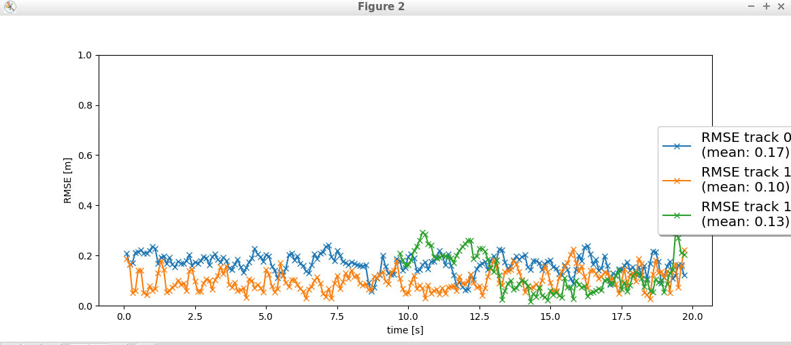

# Sensor Fusion and Object Tracking

The project is set up in four parts
1. Implement an extended Kalman Filter
2. Implement track management including track state and track source, track initialization and deletion
3. Implement single nearest neighbour data association and gating
4. Apply sensor fusion by implementing the nonlinear camera measurement model and a sensor visibility check.

## Step 1: Implementing and EKF
For this section the following are done
1. The configurations from the fpn-resnet model is copied from the previous 3D object detection mid term project. The initial RMSE had a mean of 5.59 for a single track, pre implementation.

2. As per the instruction, the predict, f, q, update, gamma and S functions are written, leading to the implenetation of a EKF. The mean RMSE is made to 0.32. There is a peak on RMSE but it will have to be removed in the next steps

## Step 2: Implementing track management and score
For this section, the trackmanagement.py file is edited to implement a track manager. The functions manage_tracks, delete_track, and handle_updated_track are finished.

## Step 3: Implementing nearest neighbour data association
For this section the association.py file is modified and the funcitons Associate, get_closest_track_and_meas, gating and MHD are implemented.

## Step 4: Implementing non linear camera measurement model
For the final section after the implementation, the stray cars tracking are removed. 

The camera-lidar fusion is an important aspect of an autonomous vehicle in sensing the environment around it. Different systems are also required to fill the gaps in the camera-lidar fusion, like adding Radars and pheripheral cameras.

The biggest challenge is the computation cost associated with this operation. New improved algorithms has to be introduced. And the code will not perform well in dark/foggy images as more improvement is needed in this aspect.

